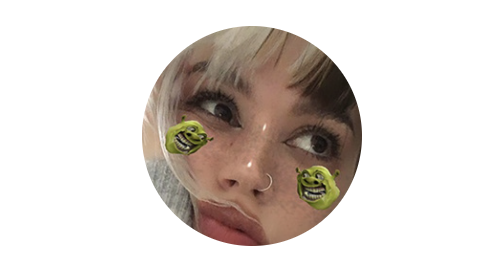

# About me

## Hi, my name is  Elizaveta Vakalova and I am a graphic designer & illustrator. ( ͝° ͜ʖ͡°)ᕤ

- [My Project case study](case-study.md) 

I am always interested in innovations and trends in design, so in my work you can see combinations of different styles, which allows me to display my own individual style
My main goal in my work is the maximum visual transmission of the customer's idea. That's why I always make contact and take into account all the main points of the task.

Besides graphic design, I also like to draw illustrations. I like to work in a style like semirealism, so the works look quite unusual, which allows people to look at them in detail and try to understand the history of the image.  
Also, I always try to use absolutely all the colors of the palette to make my illustrations look lively and multifaceted.
