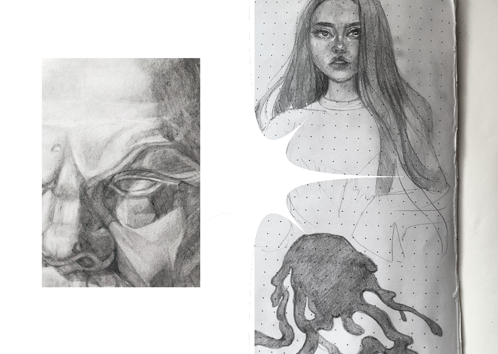
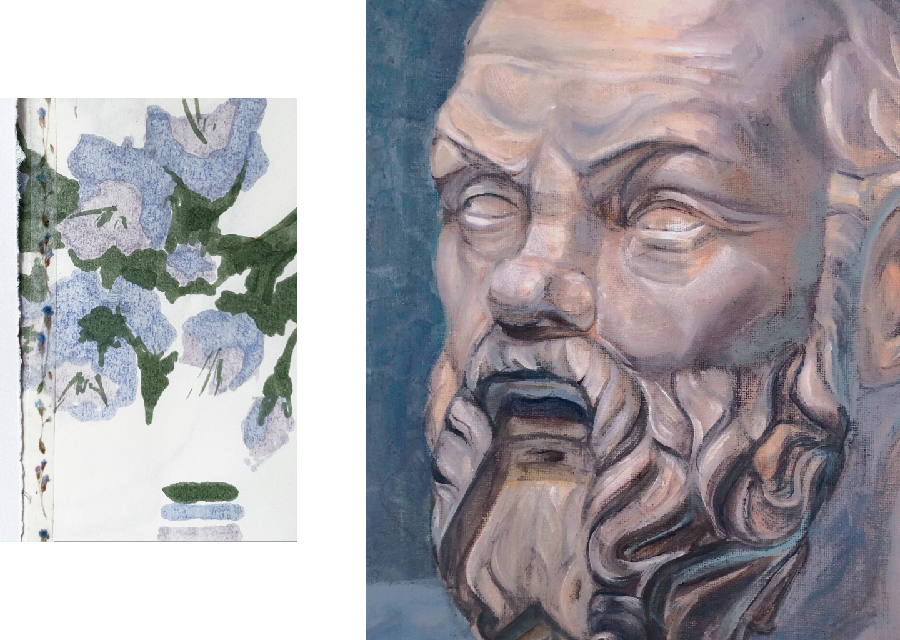

# My Story

## My Design Philosophy

I love creativity, in all its manifestations, but I am also very interested in psychology and sociology. Graphic design combines all these factors and helps to reveal them in our lives. I really enjoy studying and analyzing each person as an individual and helping to implement their ideas and visions in real life. 

I believe I can provide a creative understanding of the world. To allow people to feel it by working with me. And it is also important to show that everything that surrounds us, our world, is an integral part of art, and that each person living in it is the artist of his or her life.  

## The Creative Way

All my life I have been fascinated by art and have always been surrounded by creative people. Since my early childhood, my father took me to unusual exhibitions and there he introduced me to the works of artists and their stories. I was totally obsessed by this process, and inspired by it, I always sketched all the interesting things on paper. 

That's how I gradually started to keep my sketchbook. And there, through collages and illustrations, I wanted to express my emotions and keep all the most interesting and important moments in my life. It was an interpretation of my inner world that only I could understand.

In high school, I had already begun to learn how to draw portraits and illustrations in surrealism. I also liked using and combining a lot of different materials. I often worked with watercolors, pencils and markers. In this way I was able to achieve interesting shades of colors, which ultimately made my work even more unusual. 

Later, at one of the exhibitions in my city, I met an artist to whom I decided to show my artworks. Since then, my view of art has completely changed. This artist helped me learn all the skills of academic drawing and taught me to look at the world from a completely different perspective. He helped me grow as an artist and as a person. The reason why I decided to devote my life to art in the future is because of him. But still, besides creativity, I was also very interested in psychology and sociology, so I made the decision to become a graphic designer, and I am sure I made the right choice.

## Sources of inspiration

I am always inspired by everything around me. I really like to notice various things that people usually don't pay any attention to.
For example, it can be old broken neon signs that reflect their bright light on the white snow, while creating a great number of unusual shades that shimmer from the crystals of the snow. I am often inspired by the textures and patterns on architectural structures and look at how they are compositionally arranged. I also observe people and see how they express their emotions. For me it is observation that is the key to quality design decisions. 

Most often, I am inspired by the work of artists and designers who seem special to me and stand out from others. These works are often a combination of different styles, and they use out-of-the-box thinking to the task. It helps me to look at the design from a different way and go beyond the existing framework. Such people are different from others and after viewing their works you always want to be creative.
