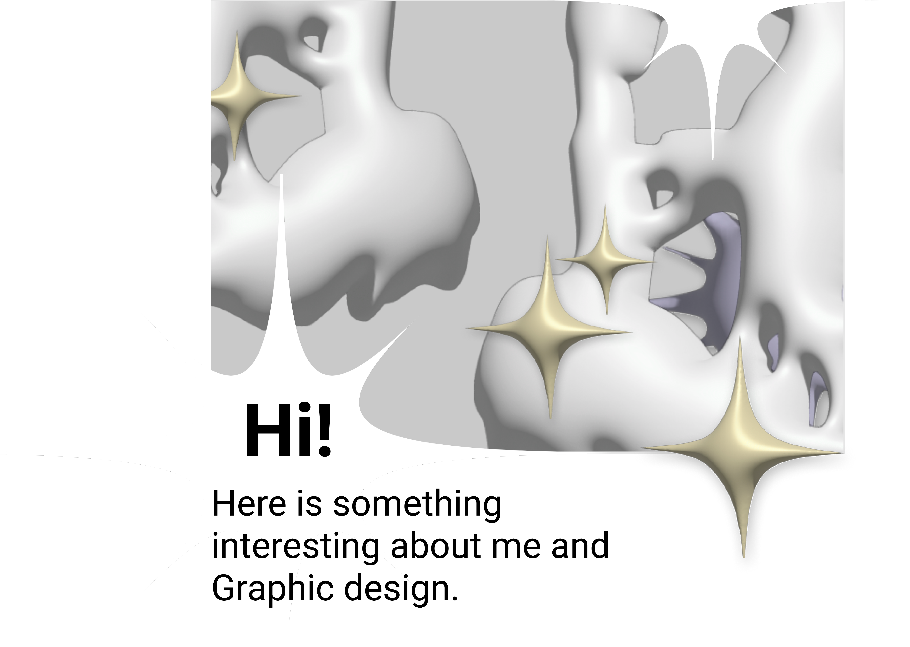

- [About me](../03-aboutness/index.md)
- [View CV](../04-experience/index.md) 

- [Character & Description](../01-character-description/index.md)
- [Impression](../02-impression/index.md)
- [Case Study](../03-aboutness/case-study.md)
- [Voice & Tone](../05-voice-tone/index.md)
- My story

## Contact
magic4jellyfish@gmail.com / 
+420 776 829718 / 
suta_tobu

## Takeaways:
1. I started working in github and understood how to use the tools correctly
2. I understood how the content structure is built
3. It is very important that the text is clear and accessible
4. I learned how to write a resume
5. Expanded my vocabulary

